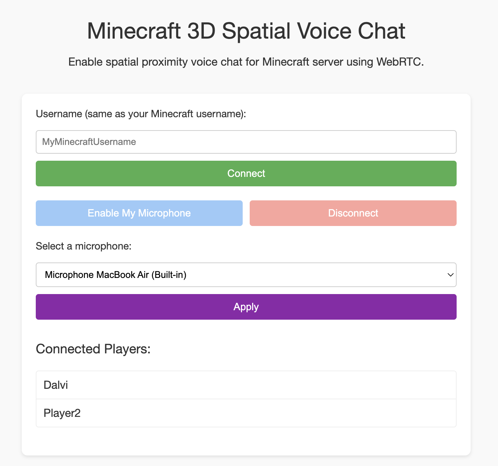

# WebVoiceChat Plugin 🌐🎙️

**WebVoiceChat** brings immersive 3D sound to Minecraft! This plugin allows players to communicate with realistic, position-based audio that enhances gameplay. Whether you're exploring dungeons, building with friends, or battling enemies, you'll hear others exactly as if they were in the same space—with sound coming from the precise direction of its source.



---

## Key Features 🌟

- **🎧 Proximity Voice Chat**: Hear players louder when they're close and softer when they're far away.  
- **🌍 Immersive 3D Audio**: Sound is positioned based on the direction and distance of other players. Know instantly if a voice is coming from your left, right, front, or behind you.  
- **🌐 Integrated WebRTC Support**: Connect using a web browser on your phone, tablet, or computer—no mods needed!  
- **⚙️ Easy Configuration**: Adjust hearing distance dynamically with a simple command.  

---

## How to Get Started 🚀

### 1️⃣ Install the Plugin  
1. 📥 Download the `WebVoiceChatPlugin.jar` file.  
2. 🗂️ Place it in your server's `plugins` folder.  
3. 🔄 Restart your server.  

### 2️⃣ Open the Voice Chat in a Browser  
Once the plugin is installed and running, open a compatible web browser and connect to the WebRTC interface.  
- By default, the interface is available at `http://your-server-ip:25566`.  
- Use the same username as your Minecraft character when logging in.  

### 3️⃣ Enjoy Talking to Nearby Players  
- 🗣️ Talk to others when you're close to them in-game.  
- Players farther away will sound quieter, and players behind you will sound different than those in front.  

---

## Commands 📜

| Command                    | Description                                      | Permission                                      |
|----------------------------|--------------------------------------------------|------------------------------------------------|
| **/setmaxdistance \<dist>** | Sets the maximum hearing distance in blocks. Default is 20 blocks. | `webvoicechat.setmaxdistance` |

**Example:**  
```
/setmaxdistance 30
```
This increases the range to 30 blocks.

---

## Troubleshooting 🛠️

- **🔇 No Sound?** Ensure your microphone permissions are enabled in your browser.  
- **🌐 Connection Issues?** Check that your server's port (`25566` by default) is open and accessible, and that your browser supports WebRTC.  
- **🎤 Microphone Selection**: You can change your microphone in the web interface's settings.  

If you encounter other issues, contact your server admin or check the details below for advanced setup.

---

### How It Works ⚙️

1. **📡 Proximity Detection**: The plugin continuously tracks player positions and determines which players are within hearing distance of each other.  
2. **🔊 Spatial Audio**: For players within range, the server calculates `volume` and `pan` (left-right positioning) and sends these values to the browser for precise audio rendering.  
3. **🔌 WebSocket Server**: The plugin starts a built-in server to manage WebRTC connections and signal audio streams.

---

### Upcoming Features 🔮

- **🔒 Authentication System**: Ensure secure connections by using a unique link sent in the in-game chat or entering a one-time authentication code displayed in the chat on the web interface.  
- **📡 Centralized WebRTC Communication**: Improve performance for large servers by centralizing WebRTC connections, preventing exponential degradation of audio quality as more players join.  
- **🔌 Optimized Player Connections**: Save bandwidth by automatically disconnecting audio streams between distant players instead of muting them. Connections will seamlessly re-establish as players move closer.  
- **🎛️ Enhanced UI Controls**: Provide better user control over the interface, including muting the microphone, selecting the audio output, and adjusting input/output volumes.  

---

## For Developers 👩‍💻👨‍💻

If you'd like to build or modify the plugin:  
1. **🔄 Clone the repository:**  
   ```bash
   git clone https://github.com/Dalvii/mc-web-voicechat.git
   cd mc-web-voicechat
   ```
2. **🛠️ Build the plugin using Gradle:**  
   ```bash
   ./gradlew shadowJar
   ```
3. **📂 Find the JAR file** in the `build/` folder.

---

### Thank You for Using WebVoiceChat! 🎉

Feel free to report bugs, request features, or contribute to development. Let’s make Minecraft communication better together! 🎙️

---

# French - Français

**WebVoiceChat** révolutionne la communication vocale dans Minecraft grâce à une expérience sonore immersive en 3D ! Ce plugin permet aux joueurs de se parler de manière réaliste, avec un son qui évolue en fonction de leur position dans l'environnement. Que vous exploriez des donjons, construisiez avec des amis ou affrontiez des ennemis, plongez dans une ambiance audio tridimensionnelle où chaque voix semble venir précisément de sa source.

---

## Caractéristiques clés

- **Chat vocal de proximité**: Entendez les joueurs plus fort lorsqu'ils sont proches et plus doux lorsqu'ils sont loin.
- **Audio 3D Immersif** : Le son est positionné en fonction de l'orientation et de la distance des autres joueurs. Vous saurez si une voix provient de votre gauche, droite, devant ou derrière.
- **Support WebRTC intégré**: Connectez-vous à l'aide d'un navigateur Web sur votre téléphone, tablette ou ordinateur, sans besoin de mods!
- **Configuration facile**: Ajustez la distance d'écoute dynamiquement avec une simple commande.

---

## Comment commencer

### 1. Installer le plugin
1. Téléchargez le fichier `WebVoiceChatPlugin.jar`.
2. Placez-le dans le dossier `plugins` de votre serveur.
3. Redémarrez votre serveur.

### 2. Ouvrez le chat vocal dans un navigateur
Une fois le plugin installé et en cours d'exécution, ouvrez un navigateur Web compatible et connectez-vous à l'interface WebRTC.
- Par défaut, l'interface est disponible à l'adresse `http://votre-ip-de-serveur:25566`.
- Utilisez le même nom d'utilisateur que votre personnage Minecraft lors de la connexion.

### 3. Profitez de parler aux joueurs à proximité
- Parlez aux autres lorsque vous êtes proche d'eux dans le jeu.
- Les joueurs plus éloignés sonneront plus doucement, et les joueurs derrière vous sonneront différemment de ceux devant.

---

## Commandes

| Commande                    | Description                                      |   Permission                                      |
|----------------------------|--------------------------------------------------|---------------------------------------------------|
| **/setmaxdistance \<dist>** | Définit la distance d'écoute maximale en blocs. La valeur par défaut est de 20 blocs. | `webvoicechat.setmaxdistance` |

Exemple:  
```
/setmaxdistance 30
```

---

## Dépannage

- **Pas de son?** Assurez-vous que vos autorisations de microphone sont activées dans votre navigateur.
- **Problèmes de connexion?** Vérifiez que le port de votre serveur (`25566` par défaut) est ouvert et accessible, et que votre navigateur prend en charge WebRTC.
- **Sélection du microphone**: Vous pouvez changer de microphone dans les paramètres de l'interface Web.

Si vous rencontrez d'autres problèmes, contactez votre administrateur de serveur ou consultez les détails ci-dessous pour une configuration avancée.

---

### Comment ça marche

1. **Détection de proximité**: Le plugin suit en continu les positions des joueurs et détermine quels joueurs sont à portée de voix les uns des autres.
2. **Audio spatial**: Pour les joueurs à portée, le serveur calcule le `volume` et le `pan` (positionnement gauche-droite) et envoie ces valeurs au navigateur pour un rendu audio précis.
3. **Serveur WebSocket**: Le plugin démarre un serveur intégré pour gérer les connexions WebRTC et signaler les flux audio.

### Prochains ajouts

- **Système d'authentification** : Garantissez des connexions sécurisées grâce à un lien unique envoyé dans le chat en jeu ou en saisissant un code d'authentification affiché dans le chat sur l'interface web.
- **Centralisation des communications WebRTC** : Améliorez les performances des grands serveurs en centralisant les connexions WebRTC, évitant ainsi la dégradation exponentielle de la qualité audio lorsque de nombreux joueurs rejoignent.
- **Optimisation des connexions entre joueurs** : Économisez la bande passante en coupant automatiquement les flux audio entre les joueurs éloignés au lieu de les mettre en sourdine. La connexion sera rétablie automatiquement et de manière transparente lorsque les joueurs se rapprochent.
- **Meilleur contrôle de l'interface utilisateur** : Offrez plus de contrôle aux utilisateurs, avec des options pour couper le microphone, choisir la sortie audio et régler les volumes d'entrée et de sortie.

---

## Pour les développeurs

Si vous souhaitez construire ou modifier le plugin:
1. Clonez le dépôt:
   ```bash
    git clone https://github.com/Dalvii/mc-web-voicechat.git
    cd mc-web-voicechat
    ```
2. Construisez le plugin en utilisant Gradle:
    ```bash
     ./gradlew shadowJar
     ```
3. Le fichier JAR compilé se trouvera dans le dossier `build/`.
   
---

### Merci d'utiliser WebVoiceChat!

N'hésitez pas à signaler des bugs, à demander des fonctionnalités ou à contribuer au développement. Améliorons ensemble la communication dans Minecraft! 🎙️
